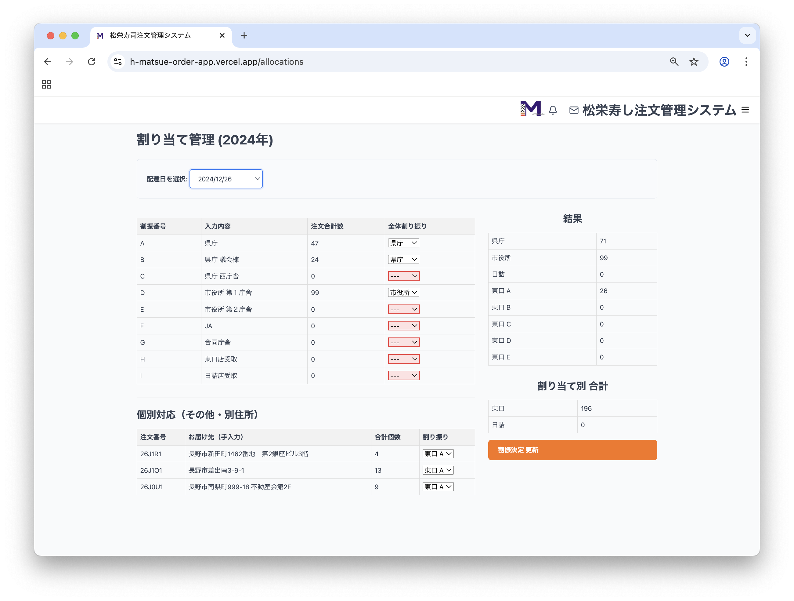
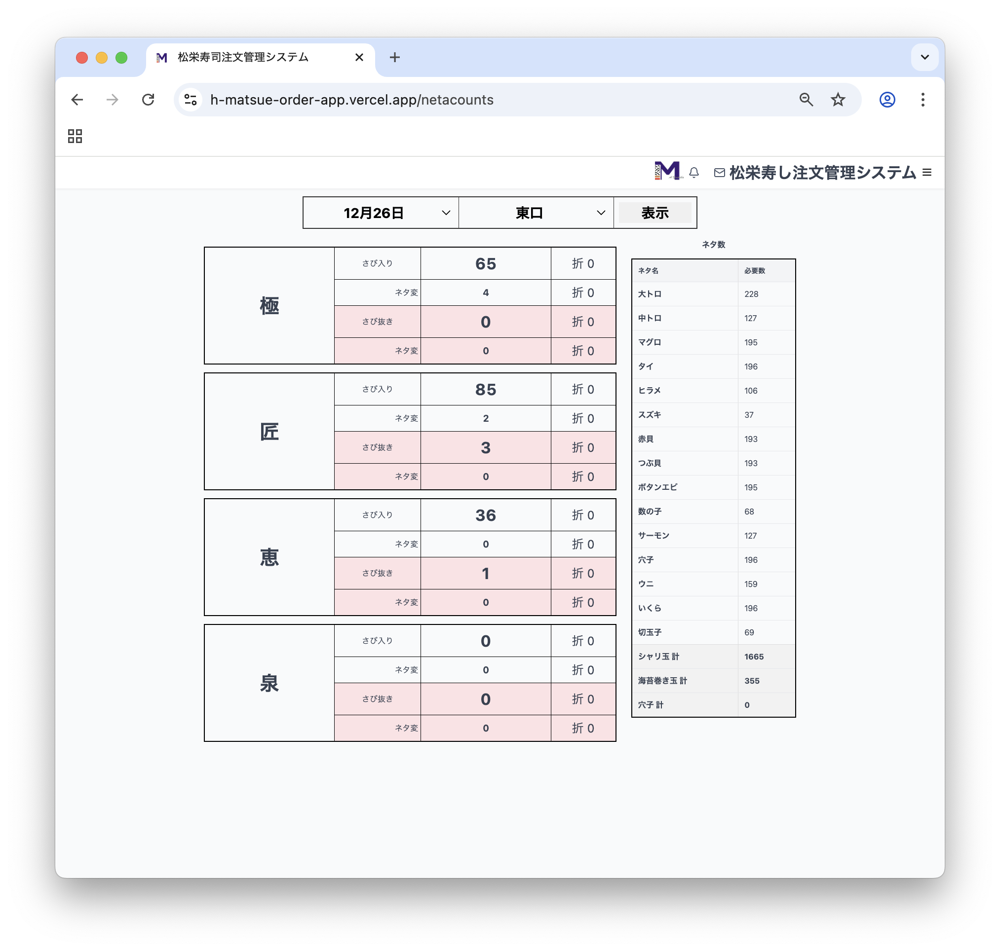
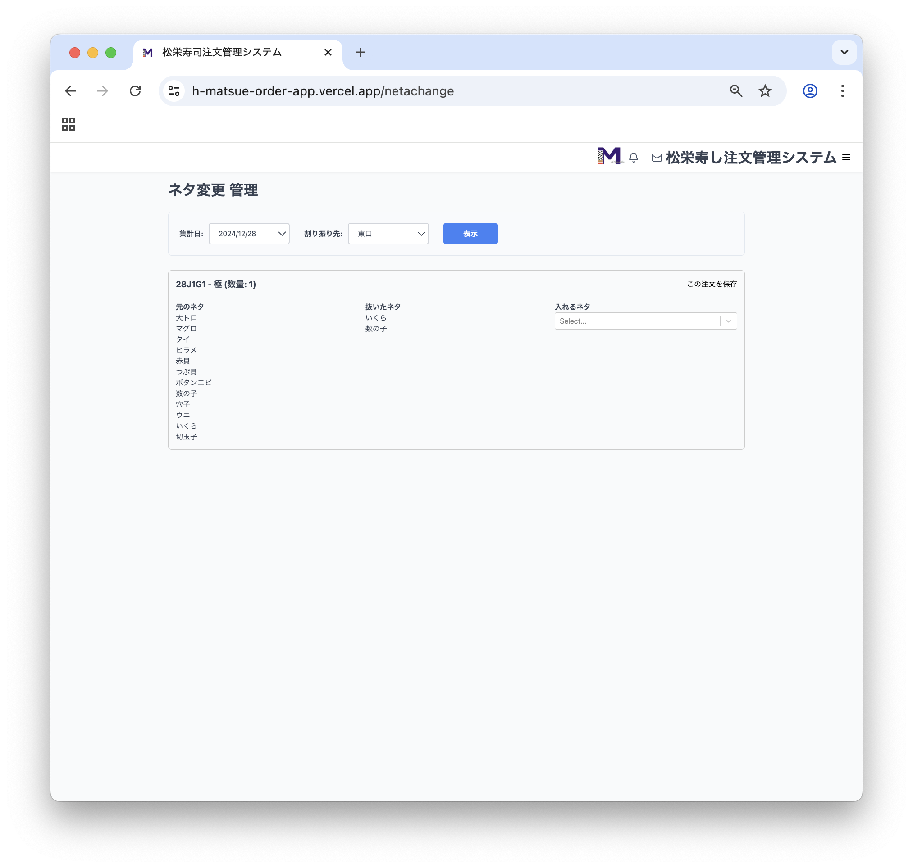

# 🍣 松栄寿司注文管理システム

年末年始などの繁忙期に特化した、Webベースの注文管理アプリケーションです。従来のExcelを使った電話・FAXによる注文管理をデジタル化し、複数人でのリアルタイムな情報共有、ミスの削減、業務の大幅な効率化を実現します。

## 📜 目次

- [✨ 主な機能](#主な機能)
- [⚠️ 注意事項](#注意事項)
- [🚀 アプリケーションの使い方](#アプリケーションの使い方)
  - [1. ログイン](#1-ログイン)
  - [2. 年度の選択](#2-年度の選択)
  - [3. 新規注文](#3-新規注文)
  - [4. 注文変更](#4-注文変更)
  - [5. 注文一覧](#5-注文一覧)
  - [6. 割振管理](#6-割振管理)
  - [7. 集計・管理機能](#7-集計管理機能)
  - [8. 設定管理](#8-設定管理)
- [📖 注文番号の見方](#注文番号の見方)
- [🤔 こんな時はどうするの？ (FAQ)](#こんな時はどうするの-faq)
- [🔧 使用技術](#使用技術)

---

## ✨ 主な機能

| 機能 | 概要 |
| :--- | :--- |
| 📅 **年度ごとのデータ管理** | 注文データや設定を年ごとに完全に分離し、安全に管理。 |
| ✍️ **リアルタイム注文管理** | 新規注文、注文内容の変更をWebフォームから直感的に入力。 |
| 🔢 **自動番号採番** | 受付番号・注文番号をルールに基づき注文時に自動で生成。 |
| 📋 **注文一覧** | 特定の日付や担当者ごとの注文状況を一覧で確認。 |
| 📄 **PDF注文確認書** | ワンクリックで注文確認書を生成・印刷。(FAX送信用) |
| 🚚 **割振管理** | 配達ルートごとの注文を可視化し、担当者を割り当て。 |
| 📊 **自動集計機能** | ネタ数や商品ごとの注文件数をリアルタイムで自動集計。 |
| ⚙️ **マスターデータ管理** | 商品メニュー、ネタの種類、配達先などのマスターデータをWeb上から簡単に編集。 |
| 📧 **メール通知 (実装中)** | 注文確定時にお客様へ自動で確認メールを送信。 最終確認メールも一覧から送信。|

---

## ⚠️ 注意事項

**ネタ変更や備考の修正を行うと、メールアドレスが登録されている注文には必ず通知メールが送信されます。**

意図しない通知を防ぐため、以下にご注意ください。
* 不用意な変更は避けてください。
* 注文内容の微調整は、一度Excelに出力してから行うことを推奨します。

---

## 🚀 アプリケーションの使い方

### 1. ログイン
アプリにアクセスすると、ログイン画面が表示されます。

### 2. 年度の選択
ログイン後、サイドバーの「年度選択」から操作したい年を選びます。ここで選択した年に基づいて、全てのデータが読み込まれます。

### 3. 新規注文
サイドバーの「新規注文」から、新しい注文を入力します。
1.  **お客様情報**: 住所記号を選択すると、登録済みの住所が自動入力されます。
2.  **注文内容**: 商品の数量を入力します。ネタ変更や特別注文もここで行います。
3.  **お支払い情報**: 支払い方法や、領収書・請求書の設定を行います。
4.  **注文内容を確認**: ボタンを押すと、最終確認の画面が表示されます。
5.  **送信**: 内容に問題がなければ「この内容で送信」ボタンを押して注文を確定します。

### 4. 注文変更
#### **方法1：「注文変更」ページから**
「注文変更」ページで受付番号を入力して検索すると、既存の注文を編集またはキャンセルできます。

#### **方法2：「注文一覧」ページから**
「注文一覧」ページで注文番号をクリックすると、その注文を直接編集またはキャンセルできます。

### 5. 注文一覧
「注文一覧」では、日付や担当者で注文を絞り込み、一覧で確認できます。
* **PDF出力**: 各注文の右側にあるPDFボタンを押すと、印刷可能な注文確認書が新しいタブで開きます。
* **メールアドレス警告**: お客様情報にメールアドレスが登録されていない注文は、PDFボタンが赤枠で表示されます。

### 6. 割振管理
「割振管理」ページでは、特定の日付の注文を建物の階層ごとにグループ化して表示します。各注文に配達担当者を割り当て、「割振決定 更新」ボタンで保存します。

### 7. 集計・管理機能
#### **ネタ数集計**
指定した日付と担当者で、必要なネタの総数を商品別・ネタ別に自動集計します。ネタ数の部分をクリックすると詳細が表示されます。

#### **ネタ変更管理**
ネタ変更が行われた注文を一覧で確認し、変更内容を管理します。

### 8. 設定管理
「設定管理」ページでは、システムの動作に必要な各種マスターデータを編集します。
* **年度更新**: 新しい年のデータが存在しない場合、前年の設定をコピーして年度更新を行うボタンが表示されます。

* **詳細設定**: 各カードをクリックすると、詳細設定画面が開きます。

---

## 📖 注文番号の見方

### 注文番号
「いつ」「どこから」「何番目」の注文かが一目でわかるように作られた、便利な6桁の番号です。

`[日付 (2桁)]` + `[受付番号 (3桁)]` + `[通し番号 (1桁)]`

### 受付番号 ([中央の3桁])
注文元の場所（建物・階数・部署）を特定するための番号です。

`[建物の記号]` + `[階数]` + `[部署の記号]`

建物の記号 (1文字目): どの建物・部署グループからの注文かを示します。（例：A → 県庁）

※各記号がどの場所に対応するかは、設定画面の「割り当て番号管理」で確認できます。

階数 (2文字目): その部署がある建物の階数がそのまま入ります。（例：7 → 7階）

部署の記号 (3文字目): 同じ階にある複数の部署を区別するための記号です。（例：A）
###

**例：`27A7A1`**
* `27` → 12月**27**日の注文
* `A7A` → **県庁7階のA部署**からの注文
* `1` → その場所での、その日**1番目**の注文各パーツの詳しい見方

---

## 🤔 こんな時はどうするの？ (FAQ)

  
<strong>1. 特別注文を追加したい</strong>

  1. 「その他のご注文」セクションから、追加したい商品を選択します。

  2. 「追加」ボタンを押すと、リストに商品が追加されます。

  3. 個数の入力欄で、必要な数量に変更してください。

  
<strong>2. 追加したい特別注文がない時</strong>

  1. 設定画面から、特殊メニュー管理を選択します。

  2. 「追加」ボタンを押すと、新しい商品の詳細を追加出来ます。

  3. 商品の詳細欄で、`[名前]`・`[金額]`・`[入れるネタ]`を追加してください。

  
<strong>3. 別の日にちの注文を追加したい</strong>

  
  1. 設定画面から、配達日管理を選択します。

  2. 「追加」ボタンを押すと、新しい配達日を`[追加]`・`[編集]`出来ます。

  
<strong>4. メールを送信したい</strong>

  # 注意　メールは一度送信をしていないと送信できません。

  自分で宛先を決めて送信する事はできません。返信・追加送信しか出来ません。

  1. ヘッダーのメールボックスを開きます。

  2. 受信トレイの中の`[送信済み]`・`[最終確認]`欄から送りたい相手を選びます。

  3. 入力欄に送りたい文字を入力し、送信を押してください。

  
<strong>5. 使いたいネタが見つからない　新しいネタの登録の仕方</strong>

  新しい商品を登録する際に使いたいネタがないことが考えられます。

  1. 設定画面からネタ種類管理を選択します。

  2. 新しいネタを追加から、使いたいネタを登録してください。

  3. 追加する際に、カテゴリを入力する必要があります。
  
  4. 集計の際に使うので使うネタが`[シャリ玉]`・`[海苔巻き玉]`など考えて入力してください。

#

---

## 🔧 使用技術

* **フロントエンド**: Next.js (React), Tailwind CSS
* **バックエンド**: AWS Lambda (Node.js, Python)
* **データベース**: AWS DynamoDB
* **認証**: AWS Cognito
* **メール送信**: AWS SES
* **ホスティング**: Vercel (フロントエンド), AWS (バックエンド)